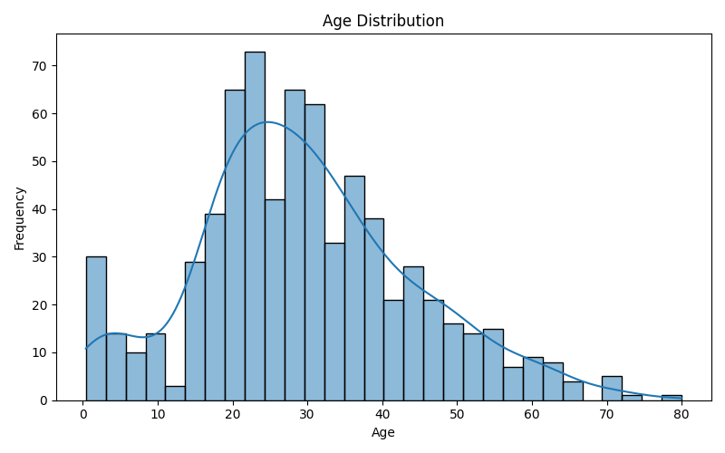
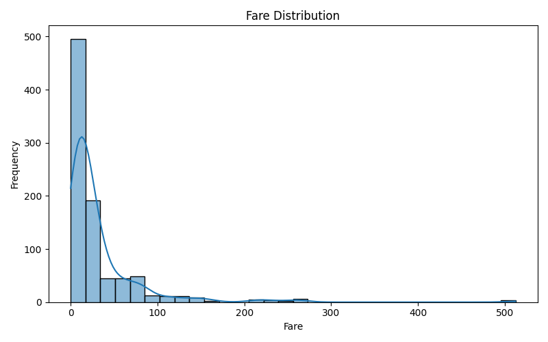
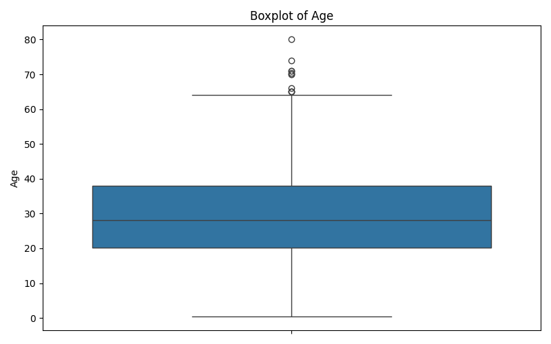
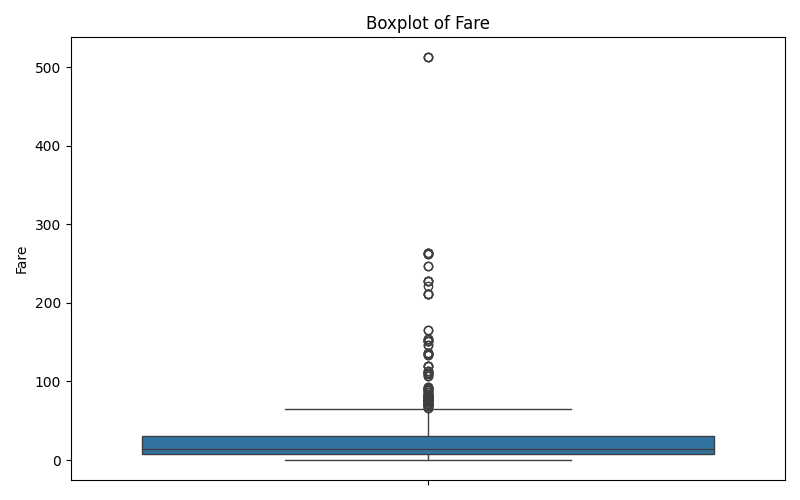
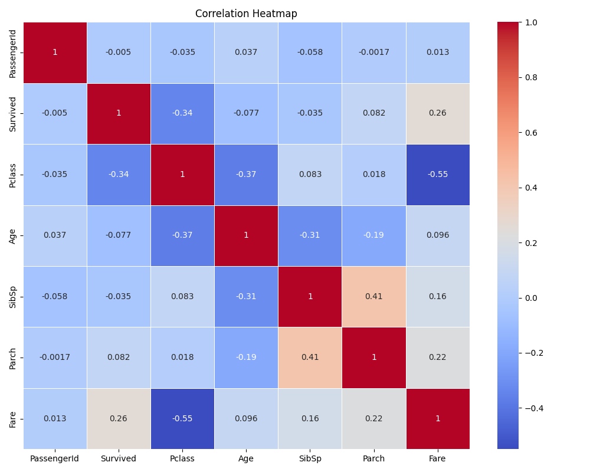
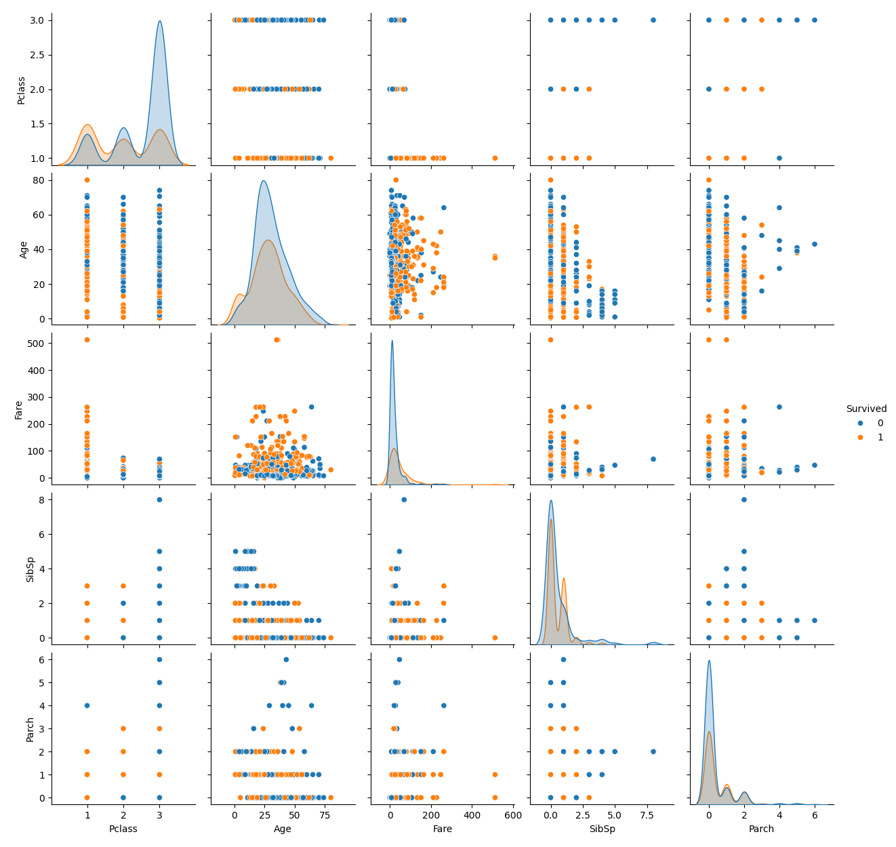

# Titanic Dataset EDA & Visualization

This repository showcases an **Exploratory Data Analysis (EDA)** project on the Titanic dataset. The main objective is to analyze, clean, and visualize the data using beginner-friendly tools to gain insights before applying machine learning.

---

## 📝 Project Summary

The dataset includes details about Titanic passengers such as age, gender, class, ticket fare, and whether they survived or not. This project focuses on:

- Identifying missing values  
- Understanding distributions  
- Exploring correlations  
- Visualizing important features

---

## 📚 Tools & Libraries Used

- Python 3.x  
- Pandas (for data analysis)  
- Matplotlib (for plots)  
- Seaborn (for beautiful charts)

---

## 🔍 EDA Process Overview

1. **First 5 Rows of Data**  
2. **Dataset Info**  
3. **Missing Values Check**  
4. **Statistical Summary**  
5. **Histograms**  
   - `age_distribution.png`  
   - `fare_distribution.png`  
6. **Boxplots**  
   - `boxplot_age.png`  
   - `boxplot_fare.png`  
7. **Heatmap for Correlation**  
   - `correlation_heatmap.png`  
8. **Pairplot for Key Features**  
   - `pairplot.png`

---

## 📁 File Structure

```
titanic-eda-visualizations/
│
├── Titanic-Dataset.csv
├── titanic_eda.py
├── age_distribution.png
├── fare_distribution.png
├── boxplot_age.png
├── boxplot_fare.png
├── correlation_heatmap.png
├── pairplot.png
└── README.md
```

---

## 📸 Visual Examples

### Age Distribution  


### Fare Distribution  


### 🔹 3. Boxplot of Age


### 🔹 4. Boxplot of Fare


### Heatmap  


### Pairplot  


---

## 👤 Author

**Sudhatanmai**

---

## 📦 Repository Name

**titanic-eda-visualizations**

---


📌 Feel free to ⭐ star, 🍴 fork, and contribute to this repository!

